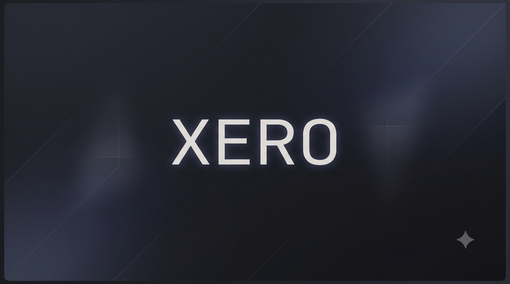

# Xero

> A minimal, aesthetic, and automated Arch Linux Hyprland setup.

Xero is a personal Arch Linux installer designed to transform a fresh Arch installation into a fully configured Hyprland desktop environment with carefully selected applications, services, themes, and dotfiles.

The goal of Xero is to provide a reproducible, clean, and modern Linux setup without manually configuring hundreds of files after installation.

---

## ✨ Features

### 🖥️ Desktop Environment

* Hyprland Wayland compositor
* Waybar status bar
* Walker application launcher
* SwayNC notification center
* Hyprlock screen locker
* Hypridle idle daemon
* Hyprpaper wallpaper manager

### 🎨 Theming

* Oxocarbon-inspired theme
* JetBrains Mono Nerd Font
* GTK 3/4 configuration
* Qt5/Qt6 theming
* Custom Fastfetch branding
* Matching terminal and system utilities

### 🛠️ Development Environment

Preconfigured tools:

* Rustup + Rust stable toolchain
* GCC / Clang
* CMake
* Ninja
* Meson
* Neovim
* Git
* GitHub CLI

### ⚡ CLI Experience

Includes:

* Zsh
* Oh My Zsh
* Custom Zsh configuration
* Starship prompt
* Fastfetch
* btop
* eza
* bat
* ripgrep
* fd
* fzf
* zoxide

### 📦 Package Management

* Pacman package installation
* Paru AUR helper setup
* Automated AUR package installation
* Full system upgrade before installation

---

# 📂 Project Structure

```
Xero/
├── config/
│   ├── hypr/
│   ├── waybar/
│   ├── walker/
│   ├── wezterm/
│   ├── swaync/
│   ├── hyprlock/
│   ├── hypridle/
│   ├── hyprpaper/
│   ├── fastfetch/
│   ├── btop/
│   ├── gtk-3.0/
│   ├── gtk-4.0/
│   ├── qt5ct/
│   ├── qt6ct/
│   └── mimeapps.list
│
├── lib/
│   ├── packages.sh
│   ├── pacman.sh
│   ├── paru.sh
│   ├── zsh.sh
│   ├── configs.sh
│   ├── services.sh
│   └── utils.sh
│
├── install.sh
└── README.md
```

---

# 🚀 Installation

## Requirements

* Fresh Arch Linux installation
* Arch-based distribution
* Internet connection
* User with sudo privileges

---

## Install

Clone the repository:

```bash
git clone git@github.com:rakshit-kant/Xero.git
cd Xero
```

Run the installer:

```bash
./install.sh
```

The installer will automatically:

1. Verify system compatibility
2. Update system packages
3. Install required packages
4. Install Paru
5. Install AUR packages
6. Configure Rust
7. Setup Zsh
8. Deploy configuration files
9. Enable required services
10. Create the Hyprland session

---

# ⚙️ Configuration Deployment

Xero keeps all configurations inside:

```
config/
```

During installation they are copied into:

```
~/.config/
```

Existing configurations are safely backed up:

```
~/.config_backup/
```

This prevents accidental overwriting of personal configurations.

---

# 🖼️ Wallpaper Setup

Wallpapers are stored separately:

```
Pictures/
└── Wallpapers/
```

Hyprpaper automatically loads the configured wallpaper after installation.

---

# 🐚 Shell Setup

Xero installs:

* Zsh
* Oh My Zsh
* Custom plugins
* Custom `.zshrc`

Existing shell configurations are backed up:

```
~/.zsh_backup/
```

---

# 🧩 Supported Systems

Xero is designed for:

✅ Arch Linux
✅ Arch-based distributions using pacman

Examples:

* EndeavourOS
* CachyOS
* Garuda Linux
* ArcoLinux

Other distributions are not officially supported.

---

# ⚠️ Important Notes

* This installer modifies system packages and user configuration files.
* Always review scripts before running them.
* A backup of existing configurations is created automatically.
* A reboot is recommended after installation.

---

# 🎯 Philosophy

Xero follows three principles:

### Minimal

Only install what is needed.

### Reproducible

A fresh system should become identical every time.

### Aesthetic

Functionality and design should coexist.

---

# 📜 License

This project is licensed under the MIT License.

---

# 👤 Author

Created by **Rakshit Kant**

Built with Bash, Arch Linux, Hyprland, and a lot of customization.
